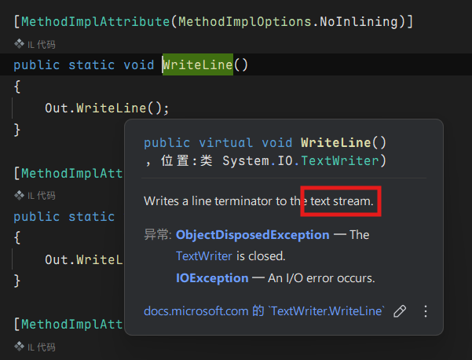
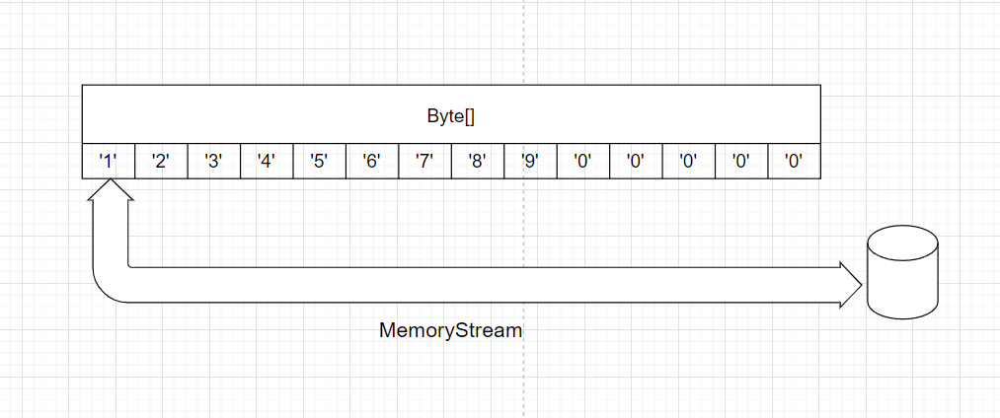
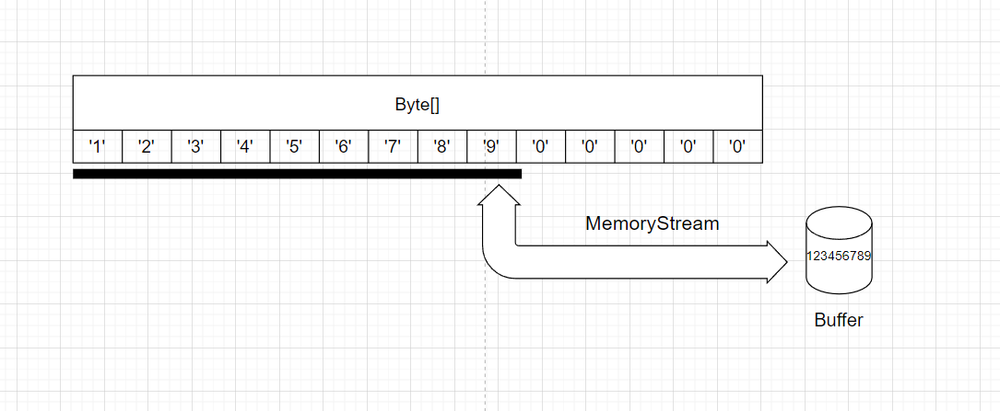
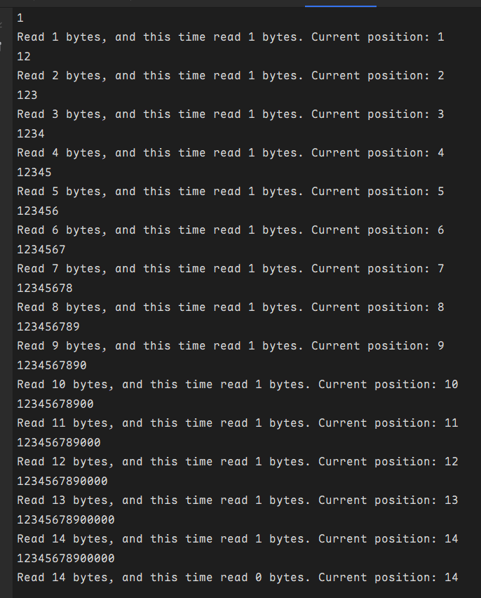
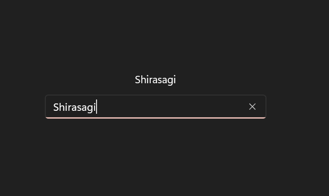
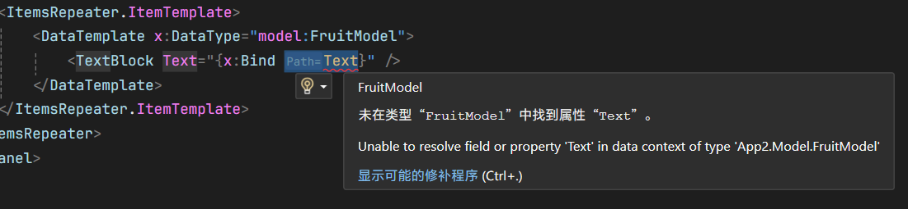
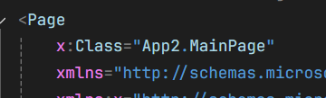

# 一些补充

这次主要是补齐一些之前没讲的内容。

## 文件 I/O

C#提供了丰富的文件操作相关的API。

### 简单方便的文件读写操作

`System.IO`命名空间下的`File`类为我们提供了非常简单的文件读写方式。你可以在[文档中](https://learn.microsoft.com/en-us/dotnet/api/system.io.file)找到接下来要用到的各个方法的用法，这里不详细介绍了。

#### 写入

只需要使用`File.WriteAllLines`/`File.WriteAllBytes`/`File.WriteAllText`（或者它们的async版本）就可以轻松完成。不需要任何其它代码，只需要在参数中填上文件路径、要写入的内容就可以了，这几个方法会自动创建文件（如果文件已经存在的话会删除原来文件的内容）。

| 方法名               | 用途           | 主要参数                                             | 处理的数据类型         | 适用场景                           | 编码处理             |
| :------------------- | :------------- | :--------------------------------------------------- | :--------------------- | :--------------------------------- | :------------------- |
| `File.WriteAllLines` | 写入多行文本   | `路径`, `字符串集合`（如数组或列表）, `编码`（可选） | 字符串集合（逐行处理） | 多行文本（日志、配置文件等）       | 支持指定，默认 UTF-8 |
| `File.WriteAllBytes` | 写入二进制数据 | `路径`, `字节数组`                                   | 字节数组（原始二进制） | 非文本文件（图片、音频、加密数据） | 无，直接写入字节     |
| `File.WriteAllText`  | 写入单个字符串 | `路径`, `字符串`, `编码`（可选）                     | 单个字符串             | 单一文本块（JSON、XML、HTML 等）   | 支持指定，默认 UTF-8 |

以上三个方法都会覆盖文件，如果想要在原来的文件后面添加内容，可以使用对应的Append版本（ `File.AppendAllLines` / `File.AppendAllBytes` / `File.AppendAllText`）

> ```csharp
> File.WriteAllText("test.txt", "Hello, World!");
> ```
>
> 写入一个`Hello, World!`，并且多次执行文件中也只有一个`Hello, World!`，因为每次`WriteAllText`都会覆盖原来的文件。
>
> 如果使用`AppendAllText`，则不会覆盖原来的文件，会在后面添加内容。

#### 读取

以上三个方法也有对应的`Read`版本（`File.ReadAllLines`/`File.ReadAllBytes`/`File.ReadAllText`）。

但是除了这三个方法，还多了一个`File.ReadLines`，看起来和`ReadAllLines`很像。它们最大的区别在于是否完全读取文件的内容，这体现在它们的返回值类型上——

- `ReadAllLines`返回一个`string[]`。

- `ReadLines`返回一个`IEnumerable<string>`，这意味着它会一行一行读取文本，在处理巨大的文件时不需要把文件完整的读取到内存后再返回结果，会提高效率。

### 更复杂的流式I/O

上面提到的简单的文件读写方法可以解决简单的问题，但是很显然它不够灵活，只能以文件为单位读写，而做不到修改/删除文件的某一小部分。

上面三个方法一样得读取整个文件到内存中（对于`ReadLines`，则是读取一行）后我们才能开始处理。编写的程序很可能需要和非常巨大的文件打交道，要是读取整个文件到内存中，用户的电脑恐怕都没有足够的内存放下全部数据！因此，我们需要一种更灵活的方式处理数据——流（Stream）。

#### 什么是**流**？

你可能已经在许多地方听过“流”了，尤其是音视频领域的一些词汇——直播推流，流媒体等等。如果你使用C++打过算法竞赛，那么肯定对`std::cin`、`std::cout`、以及头文件`iostream`不陌生，它们是标准输入输出流。

那么，什么是流呢？

吃过回转寿司吗？不同的寿司在传送带上围绕坐台运行。你可以把寿司想象成数据，而这个传送带就是流。我们可以：

- 拿取传送带上的寿司
- 把吃完的盘子放回去
- 选择你想吃的寿司


这分别代表着流的三种操作：

##### 流的操作

流有三种操作，分别是`Read`（读）、`Write`（写）和`Seek`（随机访问）。

如果有人翻开过`Console.WriteLine()`的源码的话，就会发现它和C++的`std::cout`一样，是封装好的对流的操作。我们向这个 text stream 写入文字，文字就会出现在终端上。这就是`Write`。当然，`Console.ReadLine()`也是类似的，从终端的 text stream 读取文字。



对于一部分流，我们可以控制它去读取我们想要的部分。这种操作叫做`Seek`，它可以改变流的位置（Position），它通常常见于那些用来读取已经存在了的数据的流上，e.g.用来读写文件的文件流，可以通过`Seek()`自由控制接下来从文件的哪个部分读取数据。

一个流至少实现读或写中的一种操作。这三个操作让流可以非常灵活的处理数据，而我们即将讲到的文件流`FileStream`则同时支持这三种操作（如果以读写模式打开文件的话）。

##### 流的分类

根据流支持的操作，我们可以将其分为两类：读取流和写入流

如果一个流同时支持读和写，那么它既是读取流也是写入流。

##### 流的连续性

流只有一个核心特征：连续性。

流就像小溪里的水流一样，里面的数据是连绵不绝的。它甚至可以没有开头，也可以没有结尾，只需要一边不断产生数据，然后流动到另一边处理。

##### 流的使用

概念讲完了，该来点更实际的了——代码该怎么写？

我需要一个方便演示的，不会引入其它复杂因素的，同时支持三种操作的流来做演示。`MemoryStream`内存流是一个不错的选择。它可以用来读取存放在内存里的一块数据（也就是`byte[]`字节数组），换句话说，`byte[]`就是数据的来源，不断产生数据，然后我们可以从这个流里读取它产生的数据（写入也行）。



```csharp
var memory = new byte[]
{
    0x31, 0x32, 0x33, 0x34, 0x35, 0x36, 0x37,
    0x38, 0x39, 0x30, 0x30, 0x30, 0x30, 0x30,
}; // 是 1 2 3 4 5 6 7 8 9 0 0 0 0 0 对应的 ASCII 码，
   // 以十六进制呈现

var stream = new MemoryStream(memory); // 创建一个用来操作 byte[] memory 的 MemoryStream
```

初始时，`MemoryStream`的位置位于开头，即会从字节数组的第一个值开始读取。

##### 读取

我们读取前9个字节：

```csharp
// 读取九个字节
var buffer = new byte[9];
var byte_read = stream.Read(
    buffer: buffer,
    offset: 0,
    count: 9);

Console.WriteLine(Encoding.ASCII.GetString(buffer)); 
// 把字节按ASCII码转换成字符串输出
// 输出 123456789
Console.WriteLine($"Read {byte_read} bytes");
// 输出 Read 9 bytes （即成功读取了 9 个字节）
```

我们使用`Stream.Read`方法来读取。我们需要有一个字节数组作为buffer（缓冲区），用来存放读取到的东西。然后，是`offset`参数，它控制读取到的数据存放在`buffer`的什么位置。稍后会说为什么要这么做。`count`，就是从流里读取多少字节。这里读9个字节。最后，函数的返回值是一个`int`，表示实际读取到了几个字节。读取时，流的位置也会移动。



##### 移动

我们可以使用`Seek`来移动流的位置。用法很简单，只有两个参数：

- `offset`：相对`origin`参数指定的位置移动多少字节
- `origin`:  `SeekOrigin`枚举。三个选项：相对于开头、相对于结尾、相对于当前位置。

##### 写入

`Write`和`Read`类似，同样是三个参数：

- `byte[] buffer`： 写入什么东西
- `int offset`： 从`buffer`的哪里读取东西写入
- `int count`： 写入多少字节

不过，`Write`没有返回值

##### 多次读取

前面提到了`offset`参数。有时，一次读取没法完整读取全部内容（比如下载文件），需要多次读取，最后把所有读取到的内容合并到一个`Byte[]`数组里。`offset`可以完成这件事。通过偏移写入的位置，它可以**避免覆盖缓冲区中已有的数据**，进而允许我们**在同一缓冲区的不同位置存储多次读取的数据**，而无需每次都创建新的缓冲区。

对前面的代码做改造，我们每次读取1字节，最终完整读取这个流：

```csharp
var buffer = new byte[stream.Length + 1];
// +1 是因为读取完毕后还要再读取一个字节

int byte_read = 0; // 已读取的字节数
int current_byte_read = -1;
while (current_byte_read != 0)
{
    current_byte_read = stream.Read(buffer, byte_read, 1);
    byte_read += current_byte_read;
    Console.WriteLine(Encoding.ASCII.GetString(buffer));
    Console.WriteLine($"Read {byte_read} bytes, and this time read {current_byte_read} bytes. Current position: {stream.Position}");
}
```



可以看见每次都读取了一个字节，读取完毕后还执行了一次读取，但是最后这次读取没能读取到任何东西（流已经读完了！），因此我们将其作为循环结束的条件。

#### 文件流

文件流（`FileStream`）是 C# 中用于直接操作文件的底层流类型。它提供了对文件的**细粒度控制**，允许开发者按字节读写（`Read`,`Write`）、随机访问（`Seek`）以灵活处理大文件。它使用起来会麻烦一些，但是我们通常不需要去对流做多么复杂的操作，只需要创建一个流，用别人写好的方法读取流里面的数据，然后释放一个流就完成了。前面提到的简单的文件读写方法就是对文件流的封装。

##### 创建文件流

创建 `FileStream` 时需要指定文件路径、操作模式（`FileMode`）、访问权限（`FileAccess`）等参数。

| 参数名       | 类型 | 作用                                   |
| :----------- | :--- | :------------------------------------- |
| `FileMode`   | 枚举 | 控制文件打开方式（创建、覆盖、追加等） |
| `FileAccess` | 枚举 | 控制读写权限（读、写、读写）           |
| `FileShare`  | 枚举 | 控制其他进程对文件的访问权限           |
| `bufferSize` | int  | 缓冲区大小（提升性能）                 |

以上几个枚举的所有可能值请自行查阅文档/使用IDE的补全功能获得。

##### 读取文件流

```csharp
FileStream fileStream = new FileStream("test2.txt", FileMode.Open);
var reader = new StreamReader(fileStream);
var text = reader.ReadToEnd();
fileStream.Close();
```

我们使用`StreamReader`来读取这个文件流的内容。它为我们封装好了对流的读取操作，用起来很方便，就像前面提到的简单的文件读写方法一样。当然，如果你想使用流最基础的的`Read()`和`Seek()`来完成，也是没问题的：

```csharp
FileStream fileStream = new FileStream("test2.txt", FileMode.Open);
byte[] entireFile = new byte[fileStream.Length]; // 所有数据在计算机中最终都是以字节形式存储的，因此我们使用byte[]字节数组来存放读取到的文件
fileStream.Seek(0, SeekOrigin.Begin); // 把流的位置移动到开头
fileStream.Read(entireFile, 0, entireFile.Length); // 完整读取到entireFile数组里
Console.WriteLine(Encoding.UTF8.GetString(entireFile));
fileStream.Close();
```

##### 销毁文件流

你可能发现了，在结尾使用了`Close()`方法来关闭一个文件流。这很重要！文件是操作系统提供的资源，获取并使用完毕后，我们需要及时释放它。文件流（`FileStream`）本质是操作系统资源的句柄（Handle）。如果不显式关闭流：

- **文件锁定**：其他程序无法访问该文件（直到你的程序结束）
- **内存泄漏**：未释放的流会持续占用内存
- **数据丢失风险**：缓冲区的数据可能未完全写入磁盘

很多资源都是如此，需要使用完毕就释放。对于这种资源，C#中有一个接口`IDisposable`来描述。

##### `IDisposable` 接口

`IDisposable`是一个关于资源释放的接口，它只由一个方法构成：

```csharp
public interface IDisposable
{
    void Dispose(); // 用于释放资源
}
```

- **核心作用**：约定实现类必须提供资源释放方法
- **适用对象**：所有需要手动释放的非托管资源（文件句柄、数据库连接、网络端口等）

`FileStream`实现了`IDisposable`接口，因此我们也可以使用`Dispose()`方法来释放文件资源。

```csharp
fs.Dispose();
// 等价于
fs.Close();

// FileStream.Dispose() 的内部实现：
// public void Dispose() => Close();
```

但是很多程序员会忘掉释放这些资源，所以C#提供了一个能帮我们自动调用`Dispose()`释放的机制——`using`

##### `using`代码块

`using` 代码块可以实现自动化资源管理。代码块执行完毕后，它会帮我们执行`IDisposable.Dispose()`方法，这样就不会忘掉释放了🥰

```csharp
using (FileStream fs = new FileStream("file.txt", FileMode.Open))
{
    // 使用流...
} // 此处自动调用 fs.Dispose()
```

当然，很多人觉得代码块很丑，所以也有不需要代码块的写法：

```csharp
using var fs = new FileStream("file.txt", FileMode.Open);
// 作用域结束时自动释放（无需大括号块）
```

`using`是RAII（资源获取即初始化）思想的体现。对象创建时获取资源（比如`FileStream`内部调用打开文件的接口，获取的操作系统的文件资源），然后在不需要该对象时自动释放这个资源。

- **核心思想**：将资源与对象的生命周期绑定
  - **对象创建时** 获取资源（构造函数）
  - **对象销毁时** 自动释放资源（Dispose）

如果你的类拥有一个需要释放的资源，<u>你也应该让你的类实现`IDisposable`接口</u>，在`Dispose`方法中实现释放资源的逻辑。这样，在使用这个类时，只需要使用`using`即可完成资源的自动释放。

```csharp
class Demo : IDisposable
{
    FileStream fs;
    
    public Demo(string path)
    {
        fs = new FileStream(path, FileMode.Open);
    }
    
    public void Dispose()
    {
        fs.Dispose();
    }
}
```

## `x:Bind`的一些高级用法

### 函数绑定

`x:Bind`不只是支持绑定到一个属性，还能把这个属性作为一个函数的参数。

```
{x:Bind Function(Value1, Value2)}
```

`{x:Bind}`的函数绑定解决了以前传统的`{Binding}`的不少痛点——写多重绑定和Converter，以及字符串格式化。现在，这些都可以在后台代码的函数中轻松完成。

用一个简单的页面来演示：

```xml
<StackPanel>
        <TextBlock Text="{x:Bind ViewModel.Name, Mode=OneWay}" />
        <TextBox Text="{x:Bind ViewModel.Name, Mode=TwoWay, UpdateSourceTrigger=PropertyChanged}" />
</StackPanel>
```

只有一个文本块和输入文本框，输入的内容会显示到文本块中：



但是我希望文本块显示的是类似于"Hello, Shirasagi!"这样的语句，我们可以使用一个函数来帮我们转换：

```csharp
// MainPage.xaml.cs
string GreetingConvert(string name)
{
    return $"Hello, {name}!";
}
```

嗯，接着使用函数绑定，把`ViewModel.Name`作为函数的`name`参数。

```xml
<TextBlock Text="{x:Bind {x:Bind Input.Text}}, Mode=OneWay}" />
```


这就是函数绑定，它可以用来转换数据。并且，数据绑定更新仍然正常工作。如果参数里有多个可观察对象，那么只要有一个更新，就会重新计算值。

函数绑定的参数也可以是常数（如数字`123`或者字符串`'Hello!'`，或者其它资源，或者手写`MarkupExtension`），但说实话不太方便，不如针对某个`x:Bind`单独写一个不需要其它参数的函数。

但是有一些值得注意的局限性：

- 它不支持泛型函数
- 它的参数不能是另一个函数（`{x:Bind Func1(Func2(ViewModel.Property1))}`是不行的 × ）
- 会导致隐性数据转换不工作（比如`Visibility`属性一般会把`bool`类型转换成`Visibility`枚举，但是如果是函数返回的`bool`就不会转换，需要手动转换一次。

### 事件绑定

一般我们写事件处理程序是这样写：`<Button Click="ButtonBase_OnClick" />`

但是这样写只能绑定到后台代码里的函数，使用`{x:Bind}`可以绑定到其它地方（比如`ViewModel`）里的函数：

```xml
<Button Click="{x:Bind ViewModel.ButtonBase_OnClick}" />
```

### 属性查找

你可能会在编写`DataTemplate`时遇到一个问题，`{x:Bind}`找不到`DataTemplate`外面的值！比如我们的ViewModel中有个`Text`属性，那么这样的代码是不行的🙅‍会因为`{x:Bind}`找不到`Text`属性而报错

```xml
<ItemsRepeater ItemsSource="{x:Bind ViewModel.Items}">
    <ItemsRepeater.ItemTemplate>
        <DataTemplate x:DataType="model:TestModel">
            <TextBlock Text="{x:Bind ViewModel.Text}" />
        </DataTemplate>
    </ItemsRepeater.ItemTemplate>
</ItemsRepeater>
```



这是因为在`DataTemplate`（以及`ControlTemplate`中），`{x:Bind}`的查找范围被限定在`x:DataType`/`TargetType`的类型中，自然就找不到后台代码里的值了。问题的解决方法可以参考这个：[Poker-sang | XAML的DataTemplate如何调用外部的属性（变量遮盖）](https://poker-sang.github.io/WinUI/%E8%BF%9B%E9%98%B6%E6%8A%80%E5%B7%A7/XAML%E7%9B%B8%E5%85%B3/XAML%E4%B8%ADDataTemplate%E5%8F%98%E9%87%8F%E9%9A%90%E8%97%8F%E7%9A%84%E8%A7%A3%E5%86%B3%E6%96%B9%E6%B3%95.html)

那么`{x:Bind}`的查找范围是怎样确定的呢？

- 一个`xaml`文件是一个查找范围，除非：
  - 在`DataTemplate`和`ContentTemplate`内
- 对于`xaml`文件内，查找范围取决于顶层的`x:Class`属性



这表明这个Page内的`X:Bind`会从`App2.MainPage`中查找。

---

不过，事件的处理程序并不会因为`DataTemplate`和`ContentTemplate`而导致的查找范围改变！比较如下代码：
```xml
<ItemsRepeater.ItemTemplate>
    <DataTemplate x:DataType="model:FruitModel">
        <StackPanel Orientation="Horizontal">
            <Button Click="ButtonBase_OnClick" />
            <Button Click="{x:Bind ButtonBase_OnClick}" />
        </StackPanel>
    </DataTemplate>
</ItemsRepeater.ItemTemplate>
```

第一个不会报错，而第二个会。

---

然后，`x:Bind`还可以绑定到Static的东西上去。比如我在`xaml`里声明了引入一个命名空间：`xmlns:helper="using:App2.Helper"`

其中有这么一个static类：

```csharp
public static class ConverterHelper
{
    public static string Name {get;set;} = "Shirasagi";
    public static string GreetingConvert (string name) => $"Hello, {name}!";
}
```

那我们可以这样使用它：`{x:Bind helper:ConverterHelper.Name}`

函数绑定也是可以的：`{x:Bind helper:ConverterHelper.GreetingConvert(helper:ConverterHelper.Name})}`

这对于一些可以重复使用的Converter而言非常好用。


