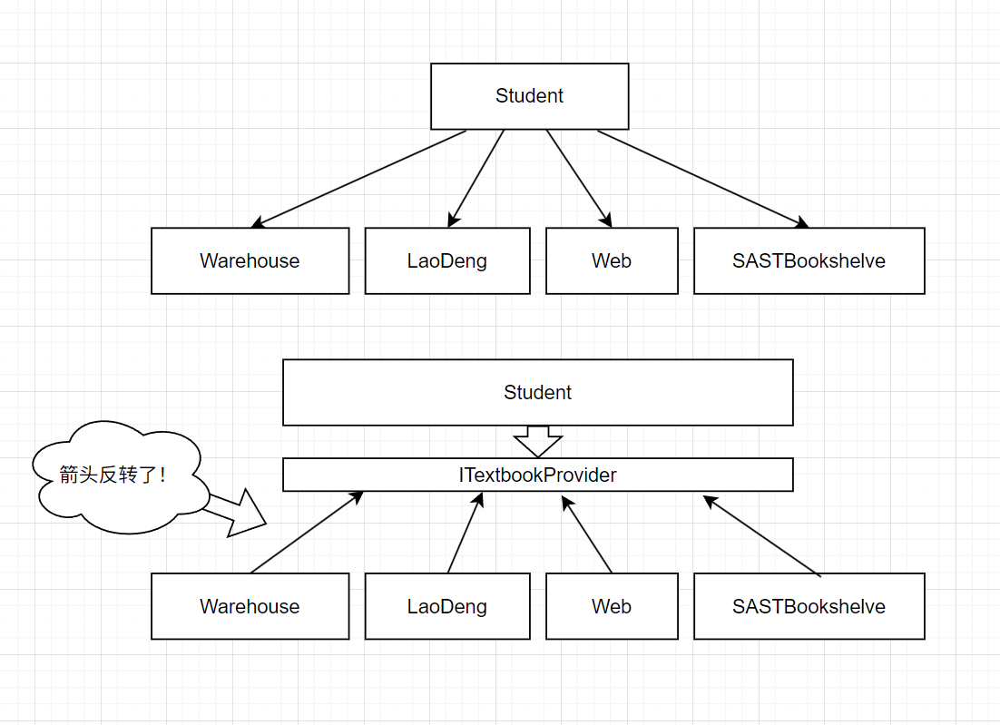

# 依赖注入

## 控制反转 - Inversion of Control

### 引入

学校的课程大多需要一本教材，通常我们会去学校的库房订购。这个过程可以抽象出来两个对象——学生和库房：

```csharp
public class Warehouse
{
    public Textbook GetTextbook() => new();
}
```

```csharp
public class Student
{
    private Textbook _myTextbook;
    
    void PrepareTextbook() { ... }
}
```

其中，`Warehouse`库房类提供了`GetTextbook()`方法，可以提供一本教材。而`Student`学生类只有私有的`PrepareTextbook`方法，表示为上课准备教材，接下来让我们实现它。

很显然我们可以通过调用`GetTextbook()`方法来获取需要的教材。但是`GetTextbook()`方法并非静态方法，这意味着我们需要一个`Warehouse`类的**实例**。怎样获得`Warehouse`类的实例呢？最直接的方法是——`new()`。

```csharp
void PrepareTextbook()
{
    var warehouse = new Warehouse();
    this._myTextbook = warehouse.GetTextbook();
}
```

#### 如果，我想从其它地方获取需要的教材？

虽然有折扣，对于月收入普遍不足2k的大学生而言，学校的教材价格还是太贵了😢。因此，许多人选择不从学校手里买教材，而是从学长手里收二手教材/电子版教材/~~你还可以从科协书柜里零成本顺几本~~。也就是说，获取教材的途径是多样的：

```csharp
public class LaoDeng // 老登
{
    public Textbook SellUsedTextbook() => this._usedTextbook;
}

public class Web
{
    public Textbook DownloadTextbook() => new();
}

public class SASTBookshelve
{
    public Textbook FindTextbook() => this._textbooks.First();
}
```

现在的`Student`类只能从`Warehouse`获取教材（代码是这么写的）。因此每多一种获取途径，我们都要对代码做相应的修改：

```csharp
void PrepareTextbook(string source)
{
    switch(source)
    {
        case "Warehouse":
            var warehouse = new Warehouse();
            this._myTextbook = warehouse.GetTextbook();
            break;
        case "LaoDeng":
            var laodeng = new LaoDeng();
            this._myTextbook = laodeng.SellUsedTextbook();
        case ...
        case ...
    }
}
```

#### 添加接口

你会发现`PrepareTextbook`内部的逻辑会随着来源数量的增加变得越来越复杂。这意味着是时候动用**抽象**这一武器了。无论我们`new()`的是一个`Warehouse`、`Laodeng`还是`Web`，目的都是为了搞到一本教材。因此我们将它们抽象成接口`ITextbookProvider`，表示能提供一本教材。

```csharp
public interface ITextbookProvider
{
    Textbook ProvideTextbook();
}
```

#### 反转

但这并不能彻底解决问题——只要我们需要在`PrepareTextBook()`方法内`new`实现了`ITextbookProvider`的类，就意味着前面的switch case是无法避免的。因此，我们需要把`new`放到其它地方去，然后传递给`PrepareTextBook()`：

```csharp
void PrepareTextbook(ITextbookProvider provider)
{
    this._myTextbook = provider.ProvideTextbook();
}
```

这样，对于`PrepareTextbook`方法而言，无论是什么来源，只要能搞到教材，它都能正确执行对应的获取教材逻辑（这个逻辑在各个实现了`ITextbookProvider`的类中）。它不仅非常灵活，而且很简短，比最开始仅支持`Warehouse`的版本还简短。

这就是*控制反转*。很懵？不急，让我来作解释：

### 控制的东西是什么？

这里主要是控制两方面：

#### 依赖的创建

要获取一本教材，需要**<u>依赖</u>**一个提供教材的东西（库房、学长、网络……）。在我们设计的程序模型中，这些东西并非提前存在的，需要我们来创建相关依赖，而前面传统的做法是<u>在`PrepareTextbook`方法里的switch中`new`了各种依赖</u>。这就表明，此时依赖的创建是由`PrepareTextbook`方法自己掌控的。

#### 对依赖的操作

`PrepareTextbook`方法里，按照传统的做法，我们`new`了各种能提供教材的对象，<u>然后分别执行逻辑，从各个对象里获取教材</u>。这就表明，此时对象的行为是由`PrepareTextbook`方法自己掌控的，对创建的依赖做什么操作全由`PrepareTextbook`说了算。

> [!TIP]
>
> 这里的依赖指的是在一个类里面明确使用了另一个类。换句话说，你把被依赖的类删了，某个类里面IDE会给一部分代码标红色波浪线，就说明这个类依赖被删除的类。

### 何为反转？

很显然，由`PrepareTextbook`方法来掌控依赖的创建和对依赖的操作会导致代码变得非常冗长——每一种可行的依赖都需要单独的代码来完成。而且很难维护，因为依赖的任何一点增删改动都需要修改这个方法，或者说，`PrepareTextbook`方法和它的依赖们**耦合**得太深了。

为解决这个问题，有人提出了一个想法——将这种控制权反转过来：

#### 反转对依赖的操作权

`PrepareTextbook`方法不应控制怎样获取教材，具体地说：

- 是通过`warehouse.GetTextbook()`？
- 还是通过`laodeng.SellUsedTextbook()`？
- 或者使用`web.DownloadTextbook()`？
- ……

都不应由`Student`类来控制，而是只去操作一个接口的方法。这个接口的背后<u>隐藏了</u>具体是谁（库房/学长/网络？）和做了什么（教务系统勾选订购教材，分发教材，交钱？/和学长谈好价钱，约定时间地点提货？/找到资源，下载，存到平板里？）,这样`Student`类不需要知道接口背后的东西也能完成所有功能。

#### 反转依赖的创建

而创建`ITextbookProvider`的操作会稍微tricky一点，在实际的项目中，通常需要一个第三者来协调。在稍后会讲到怎么完成。

当然，我们可以用`Main`函数来充当第三者协调逻辑：

```csharp
// Program.Main() @ Program.cs 
var shirasagi = new Student();

// 由第三者（Main函数）来创建依赖
ITextbookProvider dependency = new SASTBookshelves();

// 在这里我们把创建的依赖塞到了Student类的方法参数里
// 我们管这种操作叫注入依赖
shirasagi.PrepareTextbook(dependency); 
```

```csharp
// Student @ Student.cs
public class Student
{
    Textbook _myTextbook;
    
    void PrepareTextbook(ITextbookProvider provider)
    {
        // 使用接口，Student不再依赖具体的实现
        this._myTextbook = provider.ProvideTextbook(); 
    }
}
```


---

这很符合直觉：就像你去外面下馆子，你管不了厨师怎么切菜、怎么煎炒煮炸。你吃到的东西的控制权在餐厅、不在你手里。假设控制权真的在你手里，那后厨的设施、菜单与食谱、餐桌、收款二维码等一系列依赖都得由你准备，准备食材>做饭>洗碗等一系列操作全得你来负责，听着就感觉是荒谬的！



### 作用

控制反转的核心作用在于**解耦**，通过反转依赖的创建和操作权，让组件间的协作更灵活、更可持续。具体体现在：

#### 解耦组件依赖

传统的直接`new`依赖方式将`Student`与`Warehouse`等具体实现**强耦合**。控制反转后，`Student`仅依赖抽象的`ITextbookProvider`接口，**无需关心具体是哪个实现类**。这种**面向接口编程**的思维，使得组件间的依赖关系从硬编码的"混凝土"变成了灵活的"乐高积木"。

#### 提升可维护性与扩展性

当需要新增教材来源时（如添加`PirateBay`盗版网站），只需让新类实现`ITextbookProvider`接口，无需修改`Student`类的任何代码。这符合**开闭原则**（对扩展开放，对修改关闭），系统扩展成本显著降低。

#### 增强可测试性

在单元测试中，我们可以轻松创建一个`MockTextbookProvider`，返回预设的测试用教材，而无需依赖真实的库房或网络服务。这种**依赖注入**的能力，使得测试用例更纯粹、执行更快、结果更可控。

#### 职责单一化

`Student`类的职责被精简为"使用教材"，而"如何获取教材"的职责转移到了外部。每个类只需关注自己的核心逻辑，符合**单一职责原则**。就像现实中的学生不需要亲自印刷课本，只需专注学习一样。

#### 模块化与协作开发

不同团队可以并行开发`ITextbookProvider`的各个实现，只要接口约定不变，模块之间就能无缝集成。这种**契约式编程**极大提升了大型项目的协作效率。

## 依赖注入 - Dependency Injection

控制反转的最主流实现方式是依赖注入。它的核心思想是：**对象的依赖不由自身创建，而是由外部提供**。在前面，我们使用**接口**完成了依赖的操作权的反转，并且提到了依赖创建的反转需要第三者协调。在<u>依赖注入</u>这一设计模式中，使用**依赖注入容器**来作为第三者，由依赖注入容器提供对象所需的各种依赖。

### 依赖注入容器

当一个对象需要一个依赖的时候，依赖注入容器会提供所需的依赖。对于对象而言，“这个依赖是怎么来的？”这一问题是蒙在黑箱里的。它可以是为此特别`new`出来的，也可以是以前`new`出来的实例再扔给这个对象继续用。也就是说，依赖的创建权不在对象，而在依赖注入容器这个第三者，成功实现了反转！

让我们看看在 C#/.NET 中，应该如何使用依赖注入这一设计模式与依赖注入容器。

#### 安装NuGet包

首先需要安装`Microsoft.Extensions.DependencyInjection`这个NuGet包，它提供了实现依赖注入所需的全部东西。[你可以在这里](https://learn.microsoft.com/en-us/dotnet/core/extensions/dependency-injection)查看它的文档。

#### `ServiceCollection`

服务通常是一个类（或者接口），它能为程序提供一些有用的功能（比如日志记录服务`ILogger`，用户登录状态管理服务`AuthService`，后端API交互的服务`SastImageAPI`）。将服务放进服务集合里，稍后我们就能从由服务集合构建的服务容器中拿取需要的服务。

#### 简单使用

假设我们有一个简单的服务，它为程序提供了一个功能——往屏幕上打印一行文字。

```csharp
class ConsoleWriterService
{
    public void Write(string message)
    {
        Console.WriteLine($"Someone want to write: {message}");
    }
}
```

首先创建一个`ServiceCollection`

```csharp
var serviceCollection = new ServiceCollection();
```

然后向其中添加服务，也就是说在依赖注入容器中**注册**一个服务

```csharp
serviceCollection.AddSingleton<ConsoleWirterService>();
```

最后，构建，得到一个能让我们拿取所需依赖的`ServiceProvider`

```csharp
var serviceProvider = serviceCollection.BuildServiceProvider();
```

接着，使用`GetService<>()`方法，我们就能从依赖注入容器里拿需要的服务了：

```csharp
var writer = serviceProvider.GetService<ConsoleWriterService>();
writer.Write("Yay!"); // Output: Someone want to write: Yay!
```

#### 结合接口

在添加服务时，不只是能添加某个确定的类型，也可以添加接口（当然，实际上是接口和一个实现该接口的类型。毕竟它得`new()`一个出来吧，接口是不能实例化的）。这里将`ConsoleWriterService`抽象为一个`IWriter`接口，并且还有另一个实现了`IWriter`的服务`AnotherWriterService`：

```csharp
class ConsoleWriterService : IWriter
{
    public void Write(string message)
    {
        Console.WriteLine($"Someone want to say: {message}");
    }
}

class AnotherWriterService : IWriter
{
    public void Write(string message)
    {
        Console.WriteLine($"Another writer: {message}");
    }
}

internal interface IWriter
{
    void Write(string message);
}
```

要注册进依赖注入容器：

```csharp
serviceCollection.AddSingleton<IWriter, AnotherWriterService>();
// 或者
// serviceCollection.AddSingleton<IWriter, ConsoleWirterService>();
```

构建得到`ServiceProvider`，方法相同，但是获取时<u>只能使用其接口</u>！使用具体的实现类是不行的。获取时会得到你注册进依赖容器的实例类。

```csharp
// 会返回一个null： var writer = serviceProvider.GetService<ConsoleWriterService>(); 
var writer = serviceProvider.GetService<IWriter>();
writer.Write("Yay!"); 
// Output: Another writer: Yay!
```

##### 键化服务

有没有人好奇前面注册时的“或者”？你可以尝试一下如果将二者都添加进容器会发生什么。答案是一切正常，但是获取时只能获取到后注册的实例类型。

```csharp
serviceCollection.AddSingleton<IWriter, ConsoleWriterService>();
serviceCollection.AddSingleton<IWriter, AnotherWriterService>();
var serviceProvider = serviceCollection.BuildServiceProvider();

var writer = serviceProvider.GetService<IWriter>();
writer.Write("Guess which one?");
// Output: Another writer: Guess which one?
// 可以看见获取到的IWriter是后注册的AnotherWriterService
```

有时我们希望两者都能获取到，因此得有一种方法区分它们——给他们各自一个标识，即**键**（Key）。这样的服务叫做键化服务（Keyed Service）。注册一个键化服务可以使用`AddKeyedSingleton<>(object serviceKey)`。其中`serviceKey`是你对这个服务起的名字，你可以使用一个字符串。

获取键化服务不能使用`GetService<>()`，相对应的，应该使用`GetKeyedService<>(object serviceKey)`

```csharp
var serviceCollection = new ServiceCollection();
serviceCollection.AddKeyedSingleton<IWriter, ConsoleWriterService>("Console");
serviceCollection.AddKeyedSingleton<IWriter, AnotherWriterService>("Another");

var serviceProvider = serviceCollection.BuildServiceProvider();

var writer1 = serviceProvider.GetKeyedService<IWriter>("Console");
writer1.Write("Hello, World!");
// Someone want to say: Hello, World!

var writer2 = serviceProvider.GetKeyedService<IWriter>("Another");
writer2.Write("Another World!");
// Another writer: Another World!
```

#### 生命周期

依赖注入容器控制着服务的实例何时被创建、何时被销毁。而这取决于生命周期。生命周期有三种，我们先讲两种：

- 单例 Singleton：第一次获取服务时创建一个实例，此后获取该服务拿到的都是对该实例的引用。即共享同一个实例。
- 瞬态 Transient：每次获取拿到的都是不同的服务实例。

前面注册的都是单例服务。使用`AddTransient<>()`可以注册瞬态服务。接着看看瞬态服务和单例服务的区别：

```csharp
var counter1 = services.GetService<ICounter>();
var counter2 = services.GetService<ICounter>();

Console.WriteLine($"Counter1: {counter1.Count}");
Console.WriteLine($"Counter2: {counter2.Count}");

counter1.Increment();
Console.WriteLine($"Increment!");

Console.WriteLine($"Counter1: {counter1.Count}");
Console.WriteLine($"Counter2: {counter2.Count}");

counter2.Increment();
Console.WriteLine($"Increment!");

Console.WriteLine($"Counter1: {counter1.Count}");
Console.WriteLine($"Counter2: {counter2.Count}");


internal interface ICounter
{
    void Increment();
    int Count { get; }
}

internal class Counter : ICounter
{
    private int _count;

    public void Increment()
    {
        this._count++;
    }

    public int Count => this._count;
}
```

如果注册为单例服务，那么`counter1`和`counter2`是相同的，即`counter1`和`counter2`指向的是相同的对象实例，因此使用`counter1.Count`获取到的和`counter2.Count`获取到的永远是同一个东西：

```
Counter1: 0
Counter2: 0
Increment!
Counter1: 1
Counter2: 1
Increment!
Counter1: 2
Counter2: 2

// 有点像如下代码
ICounter counter = new Counter();
var counter1 = counter;
var counter2 = counter;
```

如果是瞬态呢？那么每次获取都是不同的对象实例，操作`counter1`不会影响`counter2`。

```
Counter1: 0
Counter2: 0
Increment!
Counter1: 1
Counter2: 0
Increment!
Counter1: 1
Counter2: 1

// 有点像如下代码
ICounter counter1 = new Counter();
ICounter counter2 = new Counter();
```

### 注入依赖

已经了解了依赖注入容器的基本操作。接着我们来看看依赖注入容器的用途：注入依赖。

正如前面控制反转的例子一样，服务间经常充斥着各种依赖关系。我们扩展一下`Counter`，结合前面的`IWriter`，为其添加输出的功能。这意味着`Counter`需要一个`IWriter`才能工作：

```csharp
internal class Counter : ICounter
{
    private int _count;
    private IWriter _writer;

    public void Increment()
    {
        this._count++;
        this._writer.Write($"Incremented to {this._count}");
    }

    public int Count => this._count;
}
```

没有为它提供`IWriter`的话，`Counter.Increment()`会报错，因此得给它提供一个。这里选择在构造函数里增加一个`IWriter`参数：

```csharp
public Counter(IWriter writer)
{
    _writer = writer;
}
// 你也可以使用主构造函数，更加简洁
```

按常规做法，你可能会这样new一个`Counter`：

```csharp
var counter = new Counter(new ConsoleWriterService));
```

如果依赖一层套一层，很快会出大问题，为了满足复杂的依赖关系，你有可能会写出这样的代码：

```csharp
var imageUploadService = new ImageUploadService(new ObjectStorageService(new AuthProvider(), new OSSOptions(), new Logger()), new ImageValidator(), new ImageCompressor(new ImageCompressorConfig()), new Logger());
// 它虽然不违背控制反转思想，但是很显然对可维护性毫无帮助。
```

但是，有了包含全部所需服务的依赖注入容器，我们再也不用操心服务间依赖关系的问题了！当你使用`GetService<>()`获取一个服务时，依赖注入容器会检测它的构造函数，如果发现构造函数需要某个服务才能调用，它会帮你`GetService<>()`获取这个服务。这是**构造函数注入**。

现在只需要这样就能获取一个实现`ICounter`对象的实例。不需要操心它的构造函数里需要的依赖，太轻松了！

```csharp
var counter = services.GetService<ICounter>(); // 依赖注入容器在背后悄悄获取了所需的IWriter服务，并且调用Counter的构造函数。
```

### Scoped 生命周期

依赖注入的基本内容讲完了，接下来讲三个生命周期中剩下的那个——Scoped。如果说单例生命周期是最长的（和依赖注入容器一样长），而瞬态是最短的（用后即抛），那么Scoped就是夹在中间的，可以控制其生命长短的生命周期类型。

那么怎么控制呢？你可以使用`ServiceProvider`的`CreateScope()`方法创建一个Scope。一个Scoped服务只能在Scope中被创建，并且它的生命周期和Scope相同。也就是说，在这个Scope里，Scoped服务和单例服务行为类似，获取到的永远是相同的实例。

因此，通过控制这个Scope，我们就能控制Scoped服务的生命周期。而Scope实现了`IDisposable`，只要把它`Dispose()`了，其内部的Scoped服务生命周期就结束了。

```csharp
ServiceProvider services = 
    new ServiceCollection()
       .AddScoped<ICounter, Counter>()
       .AddSingleton<IWriter, ConsoleWriterService>()
       .BuildServiceProvider();

using (var scope = services.CreateScope())
{
    var counter = scope.ServiceProvider.GetService<ICounter>(); // 需要使用scope提供的ServiceProvider来获取Scoped服务
}
```

使用`using`可以非常方便的控制scope的范围。在这个scope内，只能获取到这一个Counter，而不同的scope内获取到的是不同的Counter。

并且，在Scope被销毁时，还会调用Scoped服务的`Dispose()`方法，你可以在此时完成资源的释放。
