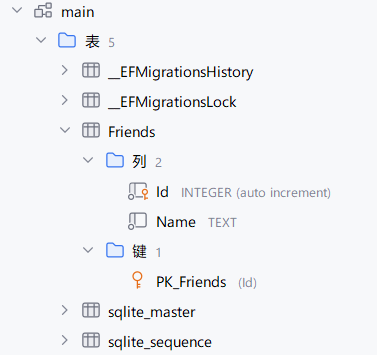

# EF Core

数据库是按照某种结构来组织，存储数据的仓库，并且速度非常快。

你可以将数据库想象成一张张表格，每一张表都有一些确定了标题的列。每一行就是存放在数据库中的数据，也被称为一条记录。对于关系型数据库系统，它还能管理每一张表对应的不同实体之间的关系，可以描述更为复杂的业务模型。

通常，我们使用一种叫做SQL的查询语言来操作关系型数据库。使用它可以在数据库中查询，增加，修改，删除。在代码中也会经常使用SQL来操作数据库，但是这会带来一些问题：

- SQL语句通常是作为纯文本，内嵌在代码中，大多数IDE无法检查。
- 修改了实体的定义后，所有相关联的SQL语句都需要被相应的修改，维护起来很麻烦。
- 查询后的结果通常是零散的，你需要手动拼成一个完整的实体。
- 添加时你也需要将实体拆开，构建一个SQL语句
- 由于会涉及手动构建SQL语句，会有SQL注入的风险！

并且，不同数据库使用的SQL语言略有差异（被称作不同的**SQL方言**），切换数据库时也会产生不小的阻力。

因此，手动编写SQL语句在可维护性，安全性都存在问题。为了更方便安全的使用数据库，你需要一个O/RM框架。ORM框架可以完成数据库对象到代码中定义的实体之间双向的映射关系；并且作为数据库上方的一层抽象，能模糊不同数据库系统之间的差异。

而Entity Framework Core，简称EF Core，是.NET社区中主流的一套全功能的ORM框架。使用它，你不需要编写任何一行SQL语句（通常你甚至不需要知道SQL是什么），即可完成从数据库架构构建到数据增删查改的全部任务。借助EF Core，可以直接使用C#编写的模型来创建表与约束。只需一行命令即可创建迁移，使数据库架构能随着不断变化的模型而演进。这种方式也被称作代码先行（Code First），即先使用C#定义模型，随后使用EF Core生成数据库架构。 

无论你是否会SQL与数据库的操作，让我们先彻底忘掉它们，看看EF Core和它独特的代码先行模式是如何操作数据库的。

## 事先准备

为了方便演示，我使用了新创建的控制台项目，并且接下来会使用不需要配置的SQLite数据库。

然后你需要安装EF Core的NuGet包`Microsoft.EntityFrameworkCore`，以及创建迁移需要的`Microsoft.EntityFrameworkCore.Design`。你还需要安装EF Core的命令行工具。打开终端执行如下命令安装`dotnet tool install --global dotnet-ef`

除此之外，你还需要一个数据库驱动。可以安装EF Core的SQLite驱动NuGet包`Microsoft.EntityFrameworkCore.Sqlite`。当然，你也可以安装其它的数据库驱动（PostgreSQL、MySQL、SQL Server都有完善的支持），接下来的内容仍然是适用的。

为了方便观察，我推荐你使用~~脑浆喷射~~JetBrains出品的DataGrip来查看和管理数据库里的数据。

## Code First

Code First是EF Core特有的一种构建数据库架构的方式。你不需要手动创建表，手动创建对应的列，手动设置主键外键以及各种约束，EF Core会根据你代码中定义的模型自动生成架构，并且创建迁移。这样，数据库的架构能始终与代码中定义的模型保持同步，并且自动迁移数据到新架构。

Code First意味着我们要先从创建模型开始。

### 构建模型

```csharp
public class Friend
{
    public long Id { get; init; }
    public string Name { get; set; }
}
```

创建一个简单的`Friend`模型。然后需要创建一个`DbContext`，用来描述数据库：

```csharp
public class FriendDbContext : DbContext
{
    public DbSet<Friend> Friends { get; set; }

    protected override void OnModelCreating(ModelBuilder modelBuilder)
    {
    }
    
    protected override void OnConfiguring(DbContextOptionsBuilder options)
        => options
           .UseSqlite($"Data Source=test.db")
           .LogTo(action: Console.WriteLine, minimumLevel: LogLevel.Debug);
}
```

`DbSet<Friend> Friends`表示这个数据库应该能存放`Friend`，并且按照约定，表名会是这个属性的名字`Friends`。

这里的`OnModelCreating`方法，在更复杂的场景下我们会使用它来配置模型之间的关系。不过，EF Core遵循约定大于配置原则，很多时候不需要单独配置，它会自动按照约定来配置模型到数据库之间的映射。

在`OnConfiguring`方法中，可以配置EF Core如何访问数据库，这里我们使用一个SQLite数据库，并且设置Log到控制台，稍后可以用来观察它生成的SQL语句。如果你使用其它数据库驱动，你也需要在这里配置对应的连接字符串。

> [!TIP]
>
> 如果你使用SQLite，推荐使用绝对路径。
>
> 因为使用命令行应用迁移的时候工作目录和在IDE内运行程序可能会不一样。
>
> 当然，也可以在代码里执行迁移，这样能保证应用执行时会使用最新的数据库架构。

### 创建迁移

模型构建完毕，接下来的任务是创建迁移，使数据库架构与模型相对应。

```
dotnet ef migrations add Initial
```

这样，我们就成功创建了一个叫做`Initial`的迁移。默认情况下，EF tool会在项目里创建一个Migrations文件夹，里面包含对应的迁移。创建了包含`Friend`模型的迁移，我们可以将目前尚是空白的数据库更新到最新的迁移：

```
dotnet ef database update
```

好，看看结果吧。使用DataGrip打开创建的SQLite数据库：



可以看见它正确的创建了能描述我们Friend模型的表。并且，它正确的按照约定将名称为`Id`的属性设置为自增主键。

### 增删查改

成功创建了数据库架构，接下来可以向数据库里塞点东西了。前面定义的`FriendDbContext`正是描述这个数据库的类。它里面包含许多`DbSet<>`，表示数据库中的实体，我们可以使用它来向数据库中的`Friends`表里添加内容。

```csharp
await using var db = new FriendDbContext();

// 你可以在这里执行迁移，它会执行和 dotnet ef database update 类似的任务
// 保证数据库已被创建且为最新的架构
// await db.Database.MigrateAsync();

var friend = new Friend { Name = "Fox", };
db.Friends.Add(friend);
await db.SaveChangesAsync();
```

这样我们就完成了一条记录的添加。非常简单吧？

在控制台可以看见输出：

```
  Executed DbCommand (13ms) [Parameters=[@p0='?' (Size = 3)], CommandType='Text', CommandTimeout='30']
  INSERT INTO "Friends" ("Name")
  VALUES (@p0)
  RETURNING "Id";
```

刚才执行的Add指令会创建一条对应的SQL语句。

查询操作也是类似的。并且`DbSet`继承自`IQueryable`，我们可以使用LINQ进行查询。它能将你传递给LINQ方法的表达式自动转换为对应的SQL语句。

```csharp
var query_friend = db.Friends.First(x => x.Id == friend.Id);
query_friend.Dump(); // Dumpify包的Dump()函数，可以很方便的查看对象的内容，就像在调试器里那样
```

```
Executed DbCommand (1ms) [Parameters=[@__friend_Id_0='?' (DbType = Int64)], CommandType='Text', CommandTimeout='30']
SELECT "f"."Id", "f"."Name"
FROM "Friends" AS "f"
WHERE "f"."Id" = @__friend_Id_0
LIMIT 1
     Friend     
┌──────┬───────┐
│ Name │ Value │
├──────┼───────┤
│ Id   │ 3     │
│ Name │ "Fox" │
└──────┴───────┘

```

并且，你发现了吗？我们最开始没有为`friend`设置ID，但是在添加后，EF Core自动为它设置了ID。EF Core提供了强大的模型更改跟踪功能，它可以跟踪所有模型的更改，并且正确的更新它们。只需要调用`SaveChanges()`，EF Core就会检测模型是否被修改，并且把修改的内容同步到数据库去。

```csharp
var query_friend = db.Friends.First(x => x.Id == friend.Id);
query_friend.Name = "Kitsune";
await db.SaveChangesAsync();

var updated_friend = db.Friends.First(x => x.Id == friend.Id);
updated_friend.Dump();
```

```
┌──────┬───────────┐
│ Name │ Value     │
├──────┼───────────┤
│ Id   │ 3         │
│ Name │ "Kitsune" │
└──────┴───────────┘
```

### 模型演进

程序是在不断进步的，模型也会不断变化。借助迁移，EF Core可以很好的处理模型的变化。

现在，`Friend`类多了一个性别属性。它是一个`enum Gender`：

```csharp
public class Friend
{
    public long Id { get; init; }
    public string Name { get; set; }
    public Gender Gender { get; set; }
}

public enum Gender
{
    Male,
    Female,
}
```

按非Code First方式，我们这时需要去修改数据库架构了。但有了EF Core，你只需要创建迁移然后应用它：
```
dotnet ef migrations add Second
dotnet ef database update
```

查看数据库，此时已经多出来了一个`Gender`列，并且之前的数据没有丢失。：


（对于SQLite，修改架构是件非常非常痛苦的事，但EF Core让我没有一点痛苦🤗）

## 实体关系

目前，我们已经学会了EF Core的简单使用，如何创建迁移，对数据库增删查改，以及使用迁移让模型不断演进。

但是真正的项目中，实体之间通常存在复杂的关系。总的而言，分为三种：

- 一对一：一个实体拥有另一个实体（比如一个学生有一个名字）
- 一对多：一个实体拥有多个另一种实体（比如一个学生有很多本书，但每本书只属于某一个学生）
- 多对多：一个实体拥有多个另一种实体，并且另一种实体也拥有多个该种类实体（比如一个学生选修了多门课程，而这些课程会被多位学生选修）

### 一对一

```csharp
public class Friend
{
    public long Id { get; init; }
    public string Name { get; set; }
    public Book FavoriteBook { get; set; }
    public Gender Gender { get; set; }
}

public class Book
{
    public long Id { get; init; }
    public Friend Owner { get; set; }
    public string Title { get; set; }
}
```

这个模型描述了一个Friend到Book的一对一关系，即每一个`Friend`都拥有一本最喜欢的书，每一本书都有一个拥有它的`Friend`。EF Core将`Friend`当中的`FavoriteBook`引用称为导航（Navigation）。如果你熟悉数据库，那你应该知道实现一对一的方式是通过外键，即在Friend表中存在一个指向Book的Id的列，Book中也存在一个指向Friend的Id的列。在EF Core中按照约定通常无需在模型中配置外键，只需要设置好导航，EF Core便能自动生成对应的外键。

> [!TIP]
>
> 由于在这里的Book是不可为空的，因此EF Core创建迁移时会创建对应的约束，不允许存在没有Book的Friend。
>
> ```
> Microsoft.EntityFrameworkCore.DbUpdateException: An error occurred while saving the entity changes. See the inner exception for details.
>  ---> Microsoft.Data.Sqlite.SqliteException (0x80004005): SQLite Error 19: 'FOREIGN KEY constraint failed'.
> ```
>
> 因此，这个迁移很可能无法直接应用，因为现有的数据库中所有Friend都没有Book。你需要删除现有的数据库，或者使Book关系可为空。

这时，EF Core会创建两张表，就像普通的一对一关系那样。当然，EF Core也支持将简单对象内联进同一张表，不过需要单独配置。

简单使用一下：

```csharp
db.Friends.AddRange([
    new()
    {
        Name = "John Doe",
        FavoriteBook = new Book { Title = "A Global History" },
    },
    new()
    {
        Name = "Shirasagi",
        FavoriteBook = new Book { Title = "Book of the Runtime" },
    }
]);

await db.SaveChangesAsync();
```

```
┌──────────────────────────────────────────────────────┐
│ List<Friend>                                         │
├──────────────────────────────────────────────────────┤
│                      Friend                          │
│ ┌──────────────┬────────────────────────────────┐    │
│ │ Name         │ Value                          │    │
│ ├──────────────┼────────────────────────────────┤    │
│ │ Id           │ 1                              │    │
│ │ Name         │ "John Doe"                     │    │
│ │ FavoriteBook │              Book              │    │
│ │              │ ┌───────┬────────────────────┐ │    │
│ │              │ │ Name  │ Value              │ │    │
│ │              │ ├───────┼────────────────────┤ │    │
│ │              │ │ Id    │ 1                  │ │    │
│ │              │ │ Title │ "A Global History" │ │    │
│ │              │ └───────┴────────────────────┘ │    │
│ │ Gender       │ Gender.Male                    │    │
│ └──────────────┴────────────────────────────────┘    │
│                        Friend                        │
│ ┌──────────────┬───────────────────────────────────┐ │
│ │ Name         │ Value                             │ │
│ ├──────────────┼───────────────────────────────────┤ │
│ │ Id           │ 2                                 │ │
│ │ Name         │ "Shirasagi"                       │ │
│ │ FavoriteBook │               Book                │ │
│ │              │ ┌───────┬───────────────────────┐ │ │
│ │              │ │ Name  │ Value                 │ │ │
│ │              │ ├───────┼───────────────────────┤ │ │
│ │              │ │ Id    │ 2                     │ │ │
│ │              │ │ Title │ "Book of the Runtime" │ │ │
│ │              │ └───────┴───────────────────────┘ │ │
│ │ Gender       │ Gender.Male                       │ │
│ └──────────────┴───────────────────────────────────┘ │
└──────────────────────────────────────────────────────┘

```


#### 联表查询

使用数据库自然避免不了在多个表之间查询数据。借助LINQ我们也可以轻松实现联表查询：
```csharp
var friends = await db.Friends
   .Include(f => f.FavoriteBook) // 会被翻译为SQL中的INNER JOIN
   .Where(f=>f.FavoriteBook.Title == "A Global History")
   .FirstOrDefaultAsync();
```

```
SELECT "f"."Id", "f"."FavoriteBookId", "f"."Gender", "f"."Name", "b"."Id", "b"."Title"
FROM "Friends" AS "f"
INNER JOIN "Book" AS "b" ON "f"."FavoriteBookId" = "b"."Id"
WHERE "b"."Title" = 'A Global History'
LIMIT 1
 						Friend                      
┌──────────────┬────────────────────────────────┐
│ Name         │ Value                          │
├──────────────┼────────────────────────────────┤
│ Id           │ 1                              │
│ Name         │ "John Doe"                     │
│ FavoriteBook │              Book              │
│              │ ┌───────┬────────────────────┐ │
│              │ │ Name  │ Value              │ │
│              │ ├───────┼────────────────────┤ │
│              │ │ Id    │ 1                  │ │
│              │ │ Title │ "A Global History" │ │
│              │ └───────┴────────────────────┘ │
│ Gender       │ Gender.Male                    │
└──────────────┴────────────────────────────────┘

```

### 一对多

假设`Friend`有一些可爱的宠物，我们继续对模型作修改：

```csharp
public class Friend
{
    public long Id { get; init; }
    public string Name { get; set; }
    public Book FavoriteBook { get; set; }
    public Gender Gender { get; set; }    
    
    public List<Animal> Pets { get; set; }
}

public class Animal
{
    public long Id { get; init; }
    public string Name { get; set; }
    public enum Gender { Male, Female }
}
```

这样就按照约定，构建了一个一对多关系。应用迁移之后，你会发现多了一个`Animal`表，其中除了Id Name Gender外，还有一个指向Friend Id的外键。而`Friends`表则没有任何变化。这是在数据库系统中实现一对多关系的标准方式。


让我们为`Shirasagi`添加一个动物朋友：

```csharp
var friend = await db.Friends
  .Where(f => f.Name == "Shirasagi")
  .Include(f => f.Pets)
  .FirstOrDefaultAsync();

await db.SaveChangesAsync();
```

然后查询：

```csharp
await db.Friends
   .Where(f => f.Name == "Shirasagi")
   .Include(f => f.Pets)
   .FirstOrDefaultAsync();
```

```
                        Friend                        
┌──────────────┬─────────────────────────────────────┐
│ Name         │ Value                               │
├──────────────┼─────────────────────────────────────┤
│ Id           │ 2                                   │
│ Name         │ "Shirasagi"                         │
│ FavoriteBook │ null                                │
│ Pets         │ ┌─────────────────────────────────┐ │
│              │ │ List<Animal>                    │ │
│              │ ├─────────────────────────────────┤ │
│              │ │         Animal                  │ │
│              │ │ ┌──────┬──────────────┐         │ │
│              │ │ │ Name │ Value        │         │ │
│              │ │ ├──────┼──────────────┤         │ │
│              │ │ │ Id   │ 2            │         │ │
│              │ │ │ Name │ "Ardea alba" │         │ │
│              │ │ └──────┴──────────────┘         │ │
│              │ │             Animal              │ │
│              │ │ ┌──────┬──────────────────────┐ │ │
│              │ │ │ Name │ Value                │ │ │
│              │ │ ├──────┼──────────────────────┤ │ │
│              │ │ │ Id   │ 3                    │ │ │
│              │ │ │ Name │ "Egretta intermedia" │ │ │
│              │ │ └──────┴──────────────────────┘ │ │
│              │ │            Animal               │ │
│              │ │ ┌──────┬────────────────────┐   │ │
│              │ │ │ Name │ Value              │   │ │
│              │ │ ├──────┼────────────────────┤   │ │
│              │ │ │ Id   │ 4                  │   │ │
│              │ │ │ Name │ "Egretta garzetta" │   │ │
│              │ │ └──────┴────────────────────┘   │ │
│              │ └─────────────────────────────────┘ │
│ Gender       │ Gender.Male                         │
└──────────────┴─────────────────────────────────────┘
```

有没有注意到`FavoriteBook`为null？这是因为我们没有联表查询Book，也就是说没有去读取Book表的内容。

### 多对多

假设每个`Friend`都在玩一些游戏，而每个游戏都有一些玩家：

```csharp
public class Friend
{
    public long Id { get; init; }
    public string Name { get; set; }
    public Book FavoriteBook { get; set; }
    public List<Animal> Pets { get; set; }
    public Gender Gender { get; set; }
    
    public List<Game> Games { get; set; }
}

public class Game
{
    public long Id { get; init; }
    public string Name { get; set; }
    
    public List<Friend> Players { get; set; }
}
```

这样就构建了一个多对多关系。除了`Games`表，它还会创建一张用于描述实体之间关系的`FriendGame`表：


这张表的每一条记录都表示一个`Friend`到`Game`的关系。而一个`Friend`可以有多个这样的关系，一个`Game`也可以有多个到`Friend`的关系，因此能描述多对多的关系。

## 更灵活的关系配置

在EF Core中，有三种方式可以用来描述实体之间的关系：约定、数据标注、Fluent API。

按照约定大于配置，配置大于代码的原则，我们通常只需要使用约定即可。如果需要，可以使用一些添加在模型上的特性来指定是什么关系。对于更复杂的需求，你可以使用Fluent API完成对实体关系的100%掌控（配置级联删除策略，配置表名，配置主键和外键，配置如何映射都可以通过Fluent API 完成）。

将刚才的模型使用Fluent API描述如下：

```csharp
protected override void OnModelCreating(ModelBuilder modelBuilder)
{
    // Friend configuration
    modelBuilder.Entity<Friend>(entity =>
    {
        entity.HasKey(e => e.Id);
        entity.Property(e => e.Id).ValueGeneratedOnAdd();
        entity.Property(e => e.Name).IsRequired().HasMaxLength(100);
        entity.Property(e => e.Gender).HasConversion<string>();

        // One-to-one relationship with Book
        entity.HasOne(e => e.FavoriteBook)
           .WithMany()
           .OnDelete(DeleteBehavior.SetNull);

        // One-to-many relationship with Animal (Friend has many Pets)
        entity.HasMany(e => e.Pets)
           .WithOne()
           .OnDelete(DeleteBehavior.Cascade);
    });

    // Game configuration
    modelBuilder.Entity<Game>(entity =>
    {
        entity.HasKey(e => e.Id);
        entity.Property(e => e.Id).ValueGeneratedOnAdd();
        entity.Property(e => e.Name).IsRequired().HasMaxLength(100);
    });

    // Book configuration
    modelBuilder.Entity<Book>(entity =>
    {
        entity.HasKey(e => e.Id);
        entity.Property(e => e.Id).ValueGeneratedOnAdd();
        entity.Property(e => e.Title).IsRequired().HasMaxLength(200);
    });

    // Animal configuration
    modelBuilder.Entity<Animal>(entity =>
    {
        entity.HasKey(e => e.Id);
        entity.Property(e => e.Id).ValueGeneratedOnAdd();
        entity.Property(e => e.Name).IsRequired().HasMaxLength(100);
    });

    // Many-to-many relationship between Friend and Game
    modelBuilder.Entity<Friend>()
       .HasMany(f => f.Games)
       .WithMany(g => g.Players)
       .UsingEntity(j => j.ToTable("FriendGame"));
}
```

