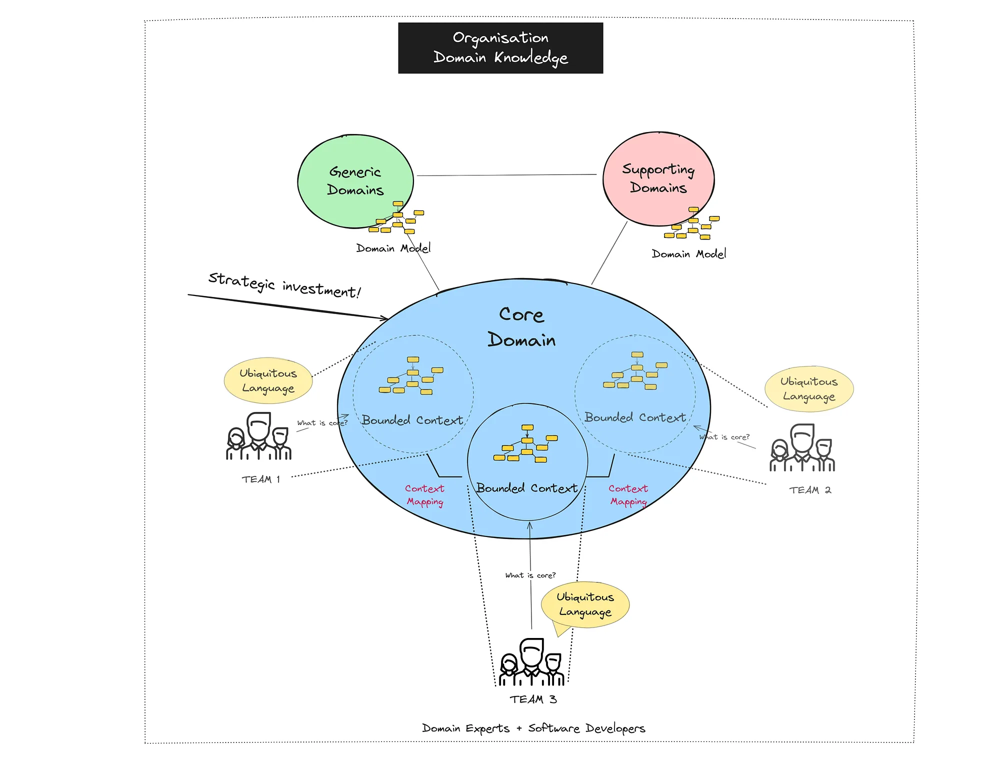

# Web应用架构

## 传统三层架构


传统三层架构将Web应用分为三层：

- **表现层**（UI，User Interface）：这一层负责接受用户的请求，并且将数据或者对应的网页返回给用户的浏览器。
  - 对于前后端一体的MVC架构的应用而言，View和Controller均属于该层。
  - 如果你的Web应用只是一个对外提供服务的WebAPI，那么API Controller属于该层。
- **业务逻辑层**（BLL，Business Logic Layer）：这一层负责执行业务逻辑。所有和你业务相关的逻辑都应该在这一层。
- **数据访问层**/持久化层（DAL，Data Access Layer）：这一层负责向其它层提供数据，以及将产生/修改的数据持久化。数据库是最常见的数据持久化手段，而与数据库打交道的代码应该在这一层。

它们三者之间存在明确的依赖关系，表现层依赖于业务逻辑层，业务逻辑层依赖于数据访问层。这样分层遵循了**关注点分离**的原则，每一层都专注于某一项任务，有助于使代码井然有序。

### 简化的项目结构

以下是一个简化的三层架构项目结构：

```plaintext
WebApplication.csproj
│
├── Controllers/                # 表现层：控制器
│   ├── HomeController.cs
│   ├── UserController.cs
│   └── ProductController.cs
│
├── Views/                      # 表现层：视图
│   ├── Home/
│   │   ├── Index.cshtml
│   │   └── About.cshtml
│   ├── User/
│   │   ├── Login.cshtml
│   │   └── Register.cshtml
│   └── Product/
│       ├── List.cshtml
│       └── Details.cshtml
│
├── Models/                     # 数据模型
│   ├── User.cs
│   └── Product.cs
│
├── Services/                   # 业务逻辑层
│   ├── UserService.cs
│   └── ProductService.cs
│
└── Data/                       # 数据访问层
    ├── Migrations/             # EF Core 迁移
    └── AppDbContext.cs         # 数据库上下文
```

- **Controllers文件夹**：包含所有控制器，负责处理HTTP请求并返回响应
- **Views文件夹**：包含所有视图，负责呈现用户界面
- **Models文件夹**：包含所有三层共享的数据模型。不过多数时候并不会共享数据模型，而是每层都有自己的数据模型，因为在不同层中，使用模型的目的也不同。比如表现层的视图模型/数据传输模型（ViewModel/DTOs），业务逻辑层的领域模型（Domain Model）
- **Services文件夹**：包含业务逻辑处理类
- **Data文件夹**：包含数据访问相关代码

### 面向接口编程

目前，我们简单的三层架构中，每一层都直接依赖于下一层，这使得各层之间的耦合度较高，难以进行单元测试和维护。为了提高架构的灵活性和可扩展性，我们可以使用接口来将各层解耦。

面向接口编程是一种设计原则，强调"依赖于抽象而非实现"。在三层架构中应用这一原则，意味着各层之间通过接口而非具体实现类进行交互：

```csharp
// 定义业务逻辑层接口
public interface IUserService
{
    User GetUserById(int id);
    bool CreateUser(User user);
    // 更多方法...
}

// 业务逻辑层实现
public class UserService : IUserService
{
    // 实现接口方法...
}

// 控制器中使用接口而非具体实现
public class UserController : Controller
{
    private readonly IUserService _userService;
    
    public UserController(IUserService userService)
    {
        _userService = userService;
    }
    
    public IActionResult GetUser(int id)
    {
        var user = _userService.GetUserById(id);
        // 处理并返回结果...
    }
}
```

### 仓储模式

前面演示了使用接口进行对业务逻辑层的抽象，接下来我们来对数据访问层进行抽象。我们使用**Repository模式**来实现这一点。

Repository模式是一种数据访问模式，它将数据访问逻辑封装在一个独立的类中，称为仓储（Repository）。仓储负责与数据源进行交互，并提供一个简单的接口供业务逻辑层使用。与直接在Service中使用EF Core上下文相比，Repository模式不仅使代码更易于测试和维护，还将数据访问技术的选择（如EF Core、Dapper）完全从业务逻辑中隔离出来，使技术迁移和架构演进变得更加顺畅。

```csharp
// 定义仓储接口
public interface IUserRepository
{
    User GetById(int id);
    IEnumerable<User> GetAll();
    void Add(User user);
    void Update(User user);
    void Delete(int id);
}

// 仓储实现
public class UserRepository : IUserRepository
{
    private readonly AppDbContext _context;
    
    public UserRepository(AppDbContext context)
    {
        _context = context;
    }
    
    // 实现接口方法...
}

// 在业务逻辑层中使用仓储
public class UserService : IUserService
{
    private readonly IUserRepository _userRepository;
    
    public UserService(IUserRepository userRepository)
    {
        _userRepository = userRepository;
    }
    
    public User GetUserById(int id)
    {
        return _userRepository.GetById(id);
        // 可以在这里添加业务逻辑...
    }
    
    // 更多方法...
}
```

#### 优势

面向接口编程与三层架构结合，可以解决刚才简单的三层架构的许多缺点：

1. **解耦**：通过接口，各层之间实现了更彻底的解耦，增强了可维护性和可测试性。
2. **依赖注入**：结合依赖注入框架，可以在运行时动态替换各层的实现，提高灵活性。
3. **单元测试**：可以轻松创建模拟对象(Mock)替代真实依赖，便于单元测试。
4. **数据访问抽象**：Repository模式隐藏了数据访问的细节，使业务逻辑层不再依赖特定的数据库技术。也就是说，只要另一个数据持久化实现能实现`IRepository`接口，它就能无缝的替换原来的数据库实现。

这种架构的演进是渐进式的，可以根据项目需求逐步从简单三层架构向更复杂、更灵活的架构过渡。在小型项目初期可以采用简单三层架构，随着项目的发展再引入接口和Repository模式，实现更高级的架构设计。

**在不停地重构中优化应用比一步到位来得更好**，这样可以：

- 避免**过度设计**导致的代码冗余，过早使用那些复杂的架构和设计模式反而会使代码难以维护。**所有抽象都是有成本的**（这里的成本指的是代码量，而不是说“零开销抽象”时的性能开销）。
- 使用简单的架构设计，快速地让应用的基本功能运行起来，而不是浪费时间在写各种接口和其它抽象上，导致项目迟迟不能上线。

## 整洁架构

前面介绍了传统的三层架构，从最简单到逐步应用各种设计模式来解决它的一些不足。但是，它仍然存在很多问题：

- 写着写着就成了以数据库为中心编程——因为数据访问层是逻辑上的最底层。
- 业务逻辑和数据访问逻辑混杂在业务逻辑层里
- 测试困难，尽管能通过面向接口降低代码的耦合度，但是逻辑上的依赖关系无法解决。测试业务逻辑必须Mock数据访问层。
- 业务逻辑复用困难

其实以上几点都是由于业务逻辑层依赖于数据访问层导致的。我们编写应用是为了解决现实问题的，因此业务逻辑和模型才是一个应用最核心、最有价值的部分。整个应用都应该围绕着它们来构建。我们也将它们称作“领域（Domain）”。

整洁架构将应用的核心——领域，置于架构的正中心：


原来的UI层，数据访问层都置于领域外侧。领域不依赖于它们，而是通过依赖倒置，只对外暴露接口。这样，使得应用核心与其余部分不存在代码上的依赖关系，进而大幅降低了为业务逻辑编写单元测试的难度。

并且UI层对Infrastructure没有任何直接依赖关系，同样，可轻松交换实现。比如，你可以在同一个应用核心上，同时维护一个WebAPI项目和一个Blazor项目，实现核心代码的100%复用。这也使得UI层能更容易地被测试和维护。

### 项目结构

整洁架构各个部分有非常明确的依赖关系，因此在使用整洁架构的应用中，通常会分为多个项目：


应用以表示层为入口点，在其内部完成依赖注入容器的构建。

#### 应用程序核心（Application Core）

应用程序核心是整洁架构中最重要的部分，它由两个主要部分组成：领域层（Domain Layer）和应用层（Application Layer）。

##### 领域层（Domain Layer）

领域层是业务核心，包含所有与业务领域相关的概念、规则和逻辑。它是整个应用程序中最稳定、最不容易变化的部分。领域层主要包括以下组件：

1. **实体（Entities）**：代表业务中的核心概念，它们有身份标识，生命周期，并包含业务规则。例如`User`、`Order`、`Product`等。

2. **值对象（Value Objects）**：没有身份标识的对象，通过其属性值来定义。它们通常是不可变的，例如`Money`、`Address`、`DateRange`等。

3. **领域服务（Domain Services）**：处理那些不自然属于任何实体或值对象的业务逻辑，尤其是跨越多个实体的操作。

4. **领域事件（Domain Events）**：用于捕获领域中发生的、对业务有意义的事件，促进领域对象间的松散耦合。

##### 应用层（Application Layer）

应用层作为领域层与外部系统（如UI和基础设施）之间的桥梁，协调领域对象完成用户的操作请求。应用层实现用例（Use Cases），但不包含业务规则，只是对领域层业务逻辑的编排，因此，这是比较单薄的一层，没有复杂的逻辑。它主要包括：

1. **应用服务（Application Services）**：这些服务协调领域对象以完成特定的应用任务或用例。它们通常不包含业务规则，而是委托给领域层。

   ```csharp
   public class OrderApplicationService
   {
       private readonly IOrderRepository _orderRepository;
       private readonly IProductRepository _productRepository;
       private readonly ICustomerRepository _customerRepository;
       private readonly IUnitOfWork _unitOfWork;
       
       public async Task<Guid> CreateOrderAsync(CreateOrderDto createOrderDto) {...}
   }
   ```

2. **数据传输对象（DTOs，Data Transfer Objects）**：用于在应用层与外部层之间传输数据的简单对象，它们不包含业务逻辑。

3. **接口抽象（Interfaces）**：应用核心定义了它需要的外部服务的接口，而不依赖于具体实现。这是依赖倒置原则的体现。

   ```csharp
   // 定义在核心层的接口
   public interface IOrderRepository {...}
   
   public interface IEmailService {...}
   ```

##### 依赖倒置

应用程序核心通过依赖倒置原则（Dependency Inversion Principle）实现对外部系统的解耦。核心原则是：

1. 高层模块不应依赖低层模块，两者都应依赖于抽象
2. 抽象不应依赖于细节，细节应依赖于抽象

在整洁架构中，这表现为：

- 接口定义在核心层，由外层实现
- 核心层不依赖于任何具体技术实现
- 依赖注入在运行时将接口和实现关联起来

例如，数据访问逻辑：

```csharp
// 在核心层定义接口
public interface IUserRepository
{
    Task<User> GetByIdAsync(int id);
    Task<IEnumerable<User>> GetAllAsync();
    Task AddAsync(User user);
}

// 在基础设施层实现接口
public class SqlServerUserRepository : IUserRepository
{
    private readonly AppDbContext _dbContext;
    
    public SqlServerUserRepository(AppDbContext dbContext)
    {
        _dbContext = dbContext;
    }
    
    public async Task<User> GetByIdAsync(int id)
    {
        return await _dbContext.Users.FindAsync(id);
    }
    
    ...
}
```

##### 应用程序核心与外部层的交互

应用程序核心通过以下方式与外部层交互：

1. **控制反转容器**：在启动时配置依赖注入，将接口映射到具体实现

   ```csharp
   services.AddScoped<IUserRepository, SqlServerUserRepository>();
   services.AddScoped<IEmailService, SmtpEmailService>();
   services.AddScoped<IUserService, UserService>();
   ```
   
2. **适配器模式**：外部系统通过适配器模式实现核心定义的接口

   ```csharp
   // 适配第三方支付系统的适配器
   public class StripePaymentAdapter : IPaymentGateway
   {
       private readonly StripeClient _stripeClient;
       
       public StripePaymentAdapter(StripeOptions options)
       {
           _stripeClient = new StripeClient(options.ApiKey);
       }
       
       public async Task<PaymentResult> ProcessPaymentAsync(PaymentRequest request)
       {
           // 将应用核心的PaymentRequest转换为Stripe特定格式
           var stripeOptions = new PaymentIntentCreateOptions
           {
               Amount = (long)(request.Amount * 100),
               Currency = request.Currency.ToLower(),
               PaymentMethod = request.PaymentMethodId,
               Confirm = true
           };
           
           var service = new PaymentIntentService(_stripeClient);
           var response = await service.CreateAsync(stripeOptions);
           
           // 将Stripe响应转换回应用核心的PaymentResult
           return new PaymentResult
           {
               Success = response.Status == "succeeded",
               TransactionId = response.Id,
               Message = response.Status
           };
       }
   }
   ```

应用程序核心的这种设计使得领域逻辑可以独立演化，业务规则不受技术实现的影响，并且便于测试。通过清晰地分离关注点，整洁架构能够创建出更加灵活、可维护且满足业务需求的软件系统。

## 领域驱动设计介绍

领域驱动设计（Domain-Driven Design，简称DDD）是一种软件开发方法论，它将重点放在核心领域和领域逻辑上，而不是技术细节。在这一点上类似于整洁架构，但是DDD不只是做到了**分离关注点**，还提供了一系列的概念、原则和模式，帮助开发人员有效地处理复杂系统中的领域复杂性。它特别适合于那些业务规则复杂、不断演进的企业级应用。

领域驱动设计值得拿出时间单独来讲，因此这一部分只会介绍一些相关的概念。

### 核心概念

#### 什么是领域

在DDD中，**领域（Domain）**指的是一个组织的业务范围，它包含所有与该业务相关的规则、流程和知识。例如，电子商务领域包括产品目录、订单处理、库存管理、支付处理等。

#### 领域模型

**领域模型（Domain Model）**是对特定领域概念的抽象表示，它捕捉了领域专家关心的核心概念、术语和关系。领域模型不是数据库模型，也不是UI模型，而是对业务概念和规则的表达。

#### 限界上下文

**限界上下文（Bounded Context）**是一个明确定义了模型适用范围的边界。在一个大型系统中，不同的部分可能有不同的模型和语言，限界上下文帮助我们明确这些边界，避免模型混淆。

例如，在一个电子商务系统中，"产品"在产品目录上下文和订单上下文中可能有不同的属性和行为。在产品目录上下文中，产品可能包含详细描述、图片、评价等信息；而在订单上下文中，产品可能只需要ID、名称和价格。

#### 通用语言

**通用语言（Ubiquitous Language）**是DDD中最重要的概念之一。它是一种在团队内共享的语言，由领域专家和开发人员共同创建和使用，用于描述领域模型和业务规则。通用语言的目的是消除领域专家和技术团队之间的沟通障碍，确保大家对领域有共同的理解。

例如，在一个医疗系统中，"患者"、"诊断"、"处方"等词汇会有明确且共享的定义，并反映在代码、文档和团队讨论中。

### DDD的分层

DDD建议将软件系统分为以下几层：

1. **展示层（UI层）**：负责向用户显示信息和解释用户指令
2. **应用层**：协调领域对象完成工作，不包含业务规则
3. **领域层**：包含业务概念、业务状态信息以及业务规则，是系统的核心
4. **基础设施层**：提供通用的技术能力，支持上述层次的工作

这种分层与整洁架构有很多相似之处，都强调业务逻辑是系统的核心，技术细节应该依赖于业务逻辑而不是相反。



### DDD的战术设计（Tactical Design）

战术设计关注的是单个限界上下文内部的细节设计，它提供了一系列模式来构建领域模型：

#### 实体

**实体（Entity）**是有唯一标识的对象，即使它的属性发生变化，它仍然是同一个对象。例如，一个用户对象，即使用户修改了姓名、地址等信息，它仍然是同一个用户。

#### 值对象

**值对象（Value Object）**是没有唯一标识的对象，它通过其属性值来定义。两个值对象如果所有属性相同，则认为它们相等。值对象通常是不可变的，这意味着创建后不能修改。

#### 聚合

**聚合（Aggregate）**是一组相关对象的集合，作为一个整体对待。每个聚合有一个**根实体（Aggregate Root）**，外部对象只能引用根实体，不能直接引用聚合内部的其他对象。聚合确保了业务规则的一致性。

#### 领域服务

**领域服务（Domain Service）**处理那些不自然属于任何实体或值对象的领域逻辑。领域服务应该是无状态的，它往往涉及多个领域对象的操作。

#### 领域事件

**领域事件（Domain Event）**是领域中发生的事情，这些事情对业务有意义，并且可能影响系统的状态。领域事件帮助我们实现松散耦合的系统。

#### 仓储模式

**仓储（Repository）**提供了一种机制，使领域对象看起来就像是存储在内存集合中一样。它隐藏了数据访问的具体细节。

### 何时使用DDD

DDD并不适合所有项目。它最适合那些具有复杂领域且需要领域专家深度参与的项目。考虑在以下情况使用DDD：

- 业务逻辑复杂
- 项目需要长期维护和演进
- 团队包括领域专家
- 需要准确捕捉业务规则和流程

对于CRUD应用或业务逻辑简单的系统，DDD可能过于复杂，不值得投入所需的时间和精力。

### DDD与微服务

DDD和微服务架构是天然匹配的。限界上下文可以作为划分微服务边界的指导原则。每个微服务可以实现一个或几个相关的限界上下文，拥有自己的数据存储和领域模型。

### 结论

领域驱动设计提供了一套强大的概念和工具，帮助我们应对复杂系统的挑战。通过将重点放在领域而不是技术上，DDD可以帮助我们构建更符合业务需求、更易于维护和演进的软件系统。在复杂业务场景下，DDD与整洁架构结合使用，可以创建出结构良好、可维护性高的应用程序。

正如我们之前强调的，应该根据项目的具体需求选择合适的设计方法。对于简单系统，传统三层架构可能已经足够；而对于复杂系统，整洁架构和DDD则提供了更好的解决方案。重要的是理解这些方法的核心原则，并灵活应用以满足你的特定需求。
