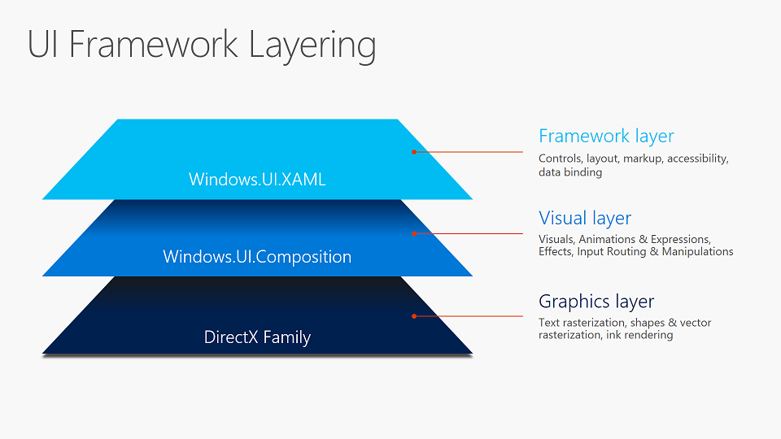
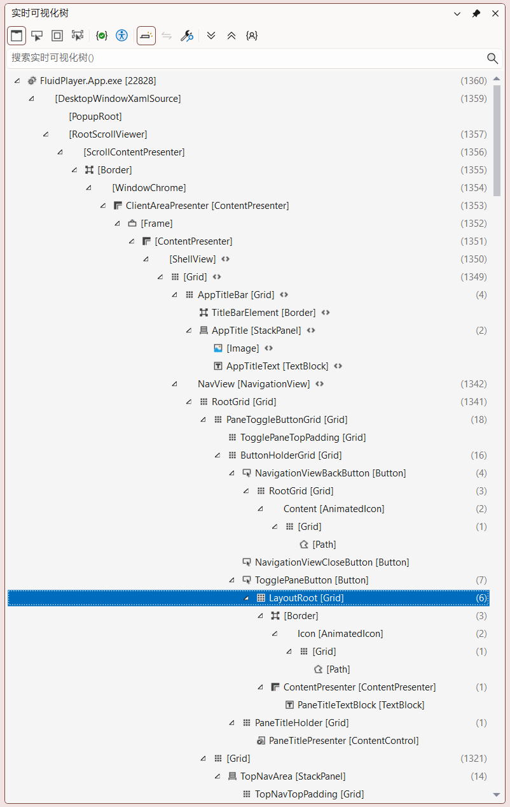
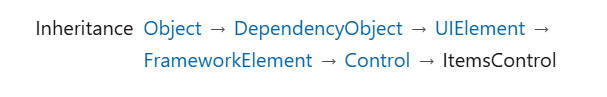
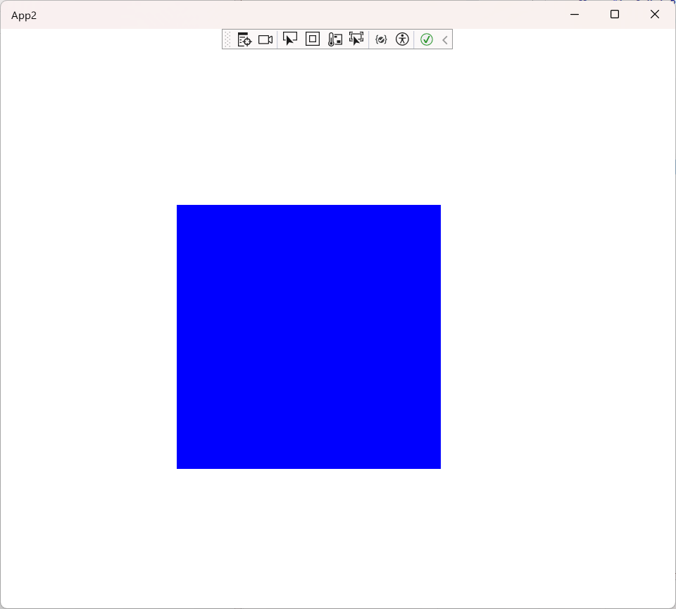
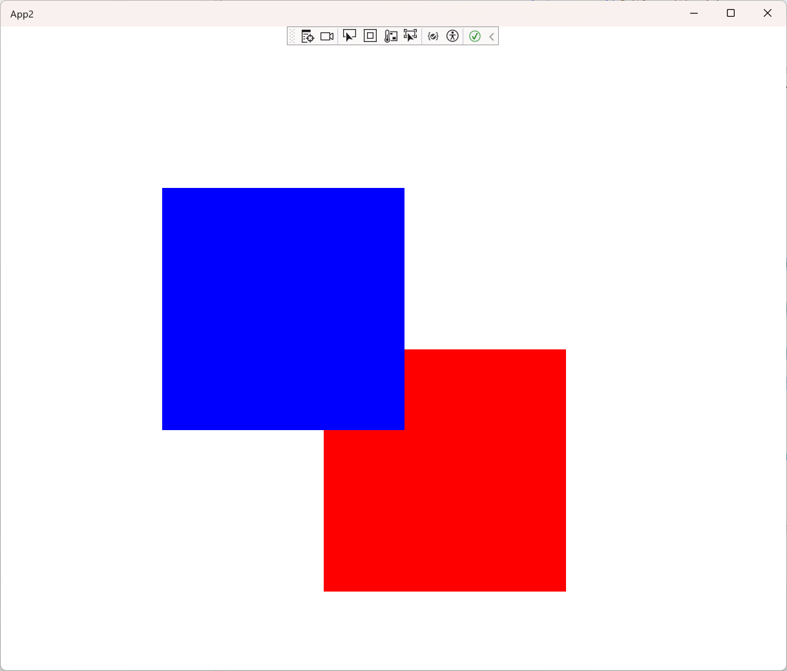
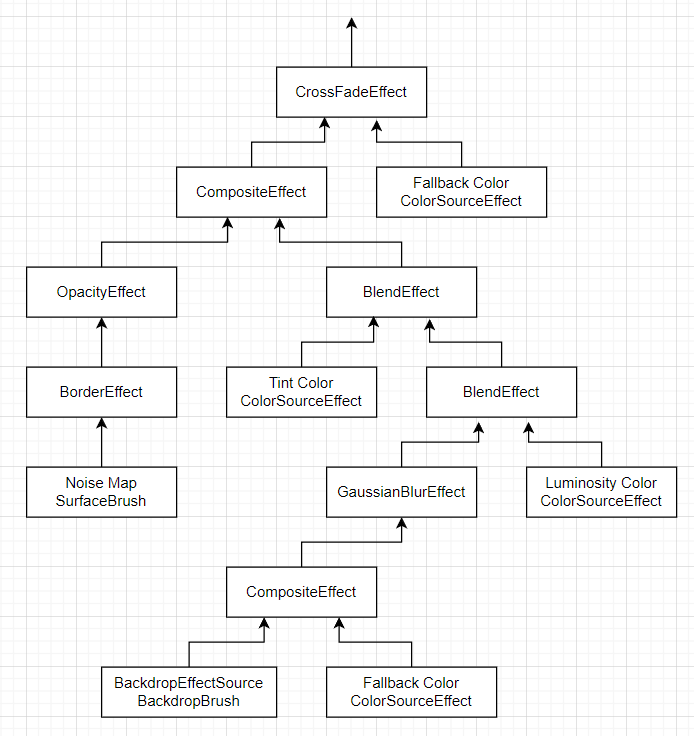
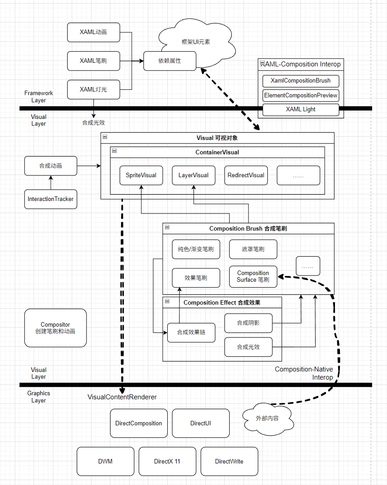

# Composition API in UWP/WinUI 3

在Windows 8中，微软为应用提供了一套全新的渲染机制`DirectComposition`，它可以让应用借助硬件加速，构建更漂亮的界面。Metro App/UWP/WinUI 3底层都是基于`DirectComposition`来完成界面和动画的渲染的。在UWP中，开发者不仅仅可以使用XAML，也可以使用底层的`DirectComposition`来绘制界面，但是直接使用它写起来非常麻烦。因此，在Windows 10中，微软提供了Composition API，让开发者无需深入底层即可在UI中添加复杂的特效，并且和XAML元素一起渲染。

## 架构



这张图代表了UWP/WinUI 3框架的结构，其中，Composition API位于Visual Layer（可视元素层）。它比XAML框架层更接近底层，但又不会深入到需要和DirectX打交道。

### Visual

这里出现了一个新概念，`Visual`（可视元素）。它是连接XAML元素和渲染引擎的桥梁。你可能已经注意到了，在调试UWP/WinUI 3应用时，有一个“Live Visual Tree（实时可视化树）”的东西，里面会按树状结构列出你的XAML元素，可以清晰的看出来元素的层级关系，还能看见框架自带的控件究竟是长什么样的。



但是，在这个Live Visual Tree上出现的都不是`Visual`，而是XAML框架的`UIElement`。`UIElement`是UWP/WinUI中几乎所有UI对象的基类：



显然，我们可以在代码里随便new一个`Button`之类的`UIElement`，但框架并不会把它渲染出来。要让一个在代码里new出来的元素显示在界面上，只需要把它添加到可视化树上——比如添加为可视化树上某个面板的子元素，或者设置为某个`ContentPresenter`/`UserControl`的`Content`。一个界面元素不能重复添加，否则会崩溃。

```csharp
var button = new Button();
this.MainGrid.Children.Add(button); // 添加为面板子元素
//或者……
this.Presenter.Content = button; // 作为某个ContentPresenter的Content
```

每一个添加到可视化树上的元素都拥有一个与之对应的`Visual`。

你在窗口内看见的元素，都是由某个`Visual`绘制出来的，并且这个`Visual`位于Visual Tree上，如果有某个`UIElement`与之相对应的话，你还能在实时可视化树里找到它。

## 使用Composition API

### 合成视觉对象

Composition API的核心就是`Visual`。接下来，让我们脱离XAML的世界，用`Visual`来绘制一些东西。但是，WinUI 3不像UWP那样可以脱离XAML而存在，因此我们需要使用`ElementCompositionPreview`，它提供了用于连接`Visual`和`UIElement`的方法，比如`GetElementVisual(UIElement)`，可以获取一个可视化树上的`UIElement`对应的`Visual`。

要创建一个`Visual`，需要使用`Compositor`，使用`GetElementVisual`获取的`Visual`中就包含了所需的`Compositor`。接下来介绍三个常用的`Visual`

#### `SpriteVisual`

`SpriteVisual`可以将一个合成笔刷的内容绘制在屏幕上。

```csharp
// 首先获取Compositor
Compositor compositor = ElementCompositionPreview.GetElementVisual(MyGrid).Compositor;

SpriteVisual sv1 = compositor.CreateSpriteVisual(); // 使用Compositor的方法创建一个SpriteVisual
sv1.Brush = compositor.CreateColorBrush(Windows.UI.Colors.Blue); // 创建一个纯色的蓝色笔刷
sv1.Size = new Vector2(300, 300); // 设置Visual绘制的大小
sv1.Offset = new Vector3(200, 200, 0); // 设置Visual绘制的相对位置

ElementCompositionPreview.SetElementChildVisual(MyGrid, sv1); 
// 最后使用SetElementChildVisual将这个Visual附加到Visual Tree上，作为MyGrid的子Visual
// 需要注意的是，一个UIElement只能有一个子Visual。
// 你可以通过GetElementChildVisual获取UIElement的子Visual
```



你可以将画刷理解为一张图片，并且，我们能对画刷应用各种复杂的效果，甚至使用DirectX自己绘制，以呈现多彩灿烂的内容。Composition API提供了许多种画刷：

- 纯色画刷
- 渐变画刷
- 效果画刷
- 遮罩画刷
- ……

#### `ContainerVisual`

由于一个`UIElement`只能有一个子Visual，如果需要设置多个子Visual，可以使用`ContainerVisual`。它是一个Visual的容器，可以向里面添加Visual。

```csharp
...
SpriteVisual sv2 = compositor.CreateSpriteVisual(); // 使用Compositor的方法创建一个SpriteVisual
sv2.Brush = compositor.CreateColorBrush(Colors.Red);
sv2.Size = new Vector2(300, 300);
sv2.Offset = new Vector3(400, 400, 0);

ContainerVisual container = compositor.CreateContainerVisual();

container.Children.InsertAtTop(sv2);
container.Children.InsertAtTop(sv1); // 蓝色的sv1后添加，在最上方
...
```



不过值得一提的是，这里介绍的剩下两个Visual全部继承自`ContainerVisual`。也就是说，这三种Visual都可以拥有子Visual。

#### `LayerVisual`

借助前面两种Visual，可以完成简单的绘制。相比`ContainerVisual`，`LayerVisual`可以将多个子Visual合并成一个图层，并且可以附加效果笔刷，实现反色、模糊等等效果。

```csharp
var graphicsEffect = new GaussianBlurEffect
{
    Name = "Blur",
    Source = new CompositionEffectSourceParameter("Backdrop"),
    BlurAmount = 10.0f,
    BorderMode = EffectBorderMode.Hard,
    Optimization = EffectOptimization.Balanced
};

var blurEffectFactory = compositor.CreateEffectFactory(graphicsEffect);
var blurBrush = blurEffectFactory.CreateBrush();

layerVisual.Effect = blurBrush; // 应用模糊效果笔刷
```

### 合成效果

效果笔刷有一个特别的属性`Source`，可以从另一个笔刷里获取内容并且对其应用特效。

效果笔刷是由一串效果构建而成的。多个特效串联起来，可以构成复杂的效果。前段时间我对照着微软开源的仓库里的代码移植了一个Windows的Acrylic亚克力效果，其结构如下：



这些效果最终产生一个`CompositionEffectFactory`，通过它可以产生效果笔刷。

除此之外，还有合成阴影与光效。

### 合成动画

简单的关键帧合成动画，可以应用在某一个Visual上

```csharp
var animation = _compositor.CreateVector3KeyFrameAnimation();
animation.InsertKeyFrame(0.5f, new Vector3(100, 0, 0));
animation.InsertKeyFrame(1.0f, new Vector3(0, 0, 0));
animation.Duration = TimeSpan.FromMilliseconds(4000);
animation.IterationBehavior = AnimationIterationBehavior.Forever;
visual.StartAnimation("Offset", animation); // Visual.StartAnimation(string target, Visual visual) 对Visual的Offset参数应用动画
```

借助XAML-Composition Interop，也可以直接对某个UIElement应用合成动画

```csharp
// Apply a simple animation to the XAML content
var animation = _compositor.CreateVector3KeyFrameAnimation();
animation.InsertKeyFrame(0.5f, new Vector3(100, 0, 0));
animation.InsertKeyFrame(1.0f, new Vector3(0, 0, 0));
animation.Duration = TimeSpan.FromMilliseconds(4000);
animation.IterationBehavior = AnimationIterationBehavior.Forever;
animation.Target = "Translation"; // 对UIElement.Translation应用动画
TextBlock1.StartAnimation(animation); // UIElement.StartAnimation(UIElement element)
```

动画还可以更复杂。合成动画支持添加参数，并且使用表达式来表示动画

```csharp
var anim = compositor.CreateExpressionAnimation();
anim.Expression = $"(above.Scale.Y - 1) * 50 + above.Translation.Y ";
anim.Target = "Translation.Y";

anim.SetExpressionReferenceParameter("above", Button1);
anim.SetScalarParameter("index", 2);
Button2.StartAnimation( anim);

anim.SetExpressionReferenceParameter("above", Button2);
anim.SetScalarParameter("index", 3);
this.Button3.StartAnimation(anim);

anim.SetExpressionReferenceParameter("above", Button3);
anim.SetScalarParameter("index", 4);
this.Button4.StartAnimation( anim);
```

## 总结



这是UWP/WinUI 3 Visual Layer层的一部分内容，主要参考了微软的文档绘制而成。

对于Graphics层我不太了解，仅仅是知道UWP/WinUI使用了哪些技术栈，不对准确性作任何保证

